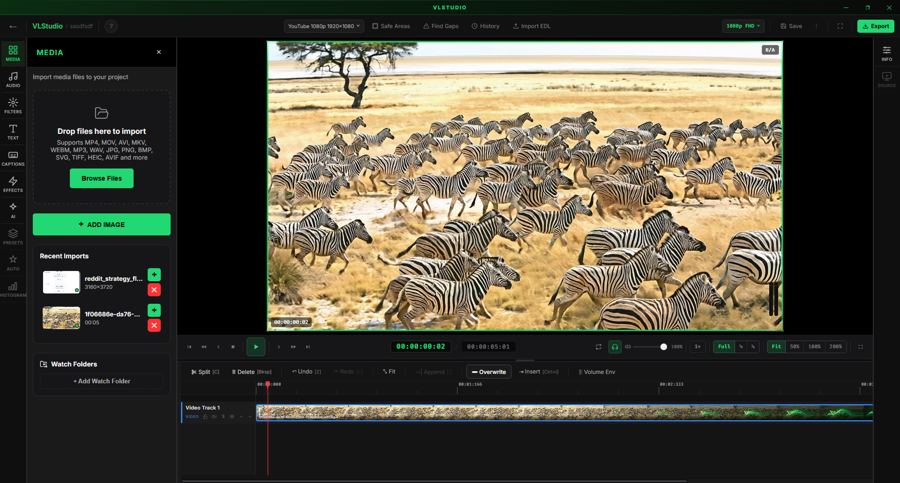

<!--
  README for the PUBLIC downloads repo: github.com/vlad044-z/vlstudio-releases
  Source of truth is docs/RELEASES_REPO_README.md in the desktop repo — edit there,
  then push to this repo's README.md. Screenshot slots are HTML comments so the
  live page never shows broken images; fill them once assets/ images are added.
-->

# ⚡ VLStudio

### A professional video editor for Windows — free.

Multi-track editing, real color grading, keying, motion tracking, and broadcast-grade
delivery formats — in a fast desktop app built on FFmpeg.
**No watermark. No export limits. No subscription to edit.**

 

<!-- SCREENSHOT: assets/hero.png — a wide shot of the editor with a project open.
     Uncomment when added:

-->

---

## Download & install

1. Download **`vlstudio_setup_<version>.exe`** from the **[latest release](https://github.com/vlad044-z/vlstudio-releases/releases/latest)**.
2. Double-click it. VLStudio installs **for your user only — no admin password needed**.
3. Launch it from the Start menu. Sign in with Google or email, and you're editing.

> ### ⚠️ "Windows protected your PC"?
> VLStudio is a new app and isn't code-signed *yet*, so Windows SmartScreen shows a
> blue warning the first time you run the installer. It's safe to continue:
>
> **Click "More info" → "Run anyway".**
>
> This is normal for new independent software — it goes away as more people install it
> (and once a signing certificate is added). You only do this once.

**Requirements:** Windows 10 or 11 (64-bit) · 8 GB RAM (16 GB recommended) · a GPU helps for playback and effects.

---

## Updates are automatic

Once installed, VLStudio keeps itself up to date. When you open the app it checks for a
newer version, downloads only what changed in the background, and offers a **Restart Now**
button to apply it. You never re-download the installer by hand.

---

## What's inside

**✂️ Editing** — unlimited multi-track timeline (drag, trim, ripple delete, nesting, markers),
clip speed 0.25×–4× with pitch compensation, per-property keyframing with a curve editor, full undo/redo.

**🎨 Color & look** — curves-based grading (Master / R / G / B) with a live RGB histogram,
visual presets (Cinematic, Vintage, Film Noir, Dream, Vibrant…), and effects: brightness,
contrast, saturation, hue, temperature, sharpness, blur, grain, vignette, glow, plus 24
Premiere-compatible blend modes.

**🟢 Keying & compositing** — Chroma, Ultra, and Luma keys, Difference Matte, Corner Pin with
magnetic snapping, and a node-based compositor for advanced graphs *(PRO)*.

**🎯 Motion tracking** — point, planar, and full 3D camera tracking, plus Warp Stabilizer *(PRO)*.

**🔊 Audio** — multi-track audio, volume envelopes, an effects chain, and Web Audio analysis.

**💬 Text & captions** — on-screen text with per-caption styling and automatic speech-to-text captions.

**📦 Export & delivery** — MP4 (H.264/H.265), WebM (VP9/AV1), GIF, animated WebP; ProRes, DNxHR,
still frames, and audio stems *(PRO)*; broadcast/cinema delivery — MXF, DCP, IMF — plus EDL /
FCPXML / AAF-OMF handoff *(PRO)*; and a batch render queue.

<!-- SCREENSHOTS: assets/timeline.png + assets/grading.png — feature shots.
     Uncomment when added:

  
  

-->

---

## Free editor + optional VLS PRO

The editor is **free forever** — it runs entirely on your machine, so there's nothing to
charge for. **VLS PRO** (€10/month, 7-day free trial) unlocks the cloud- and compute-heavy
extras: the node compositor, 3D camera solve, Warp Stabilizer, pro export/delivery formats,
and unlimited cloud review collaboration. Start a trial at **[vlstudio.live](https://www.vlstudio.live)**.

---

## Support & feedback

- 🌐 **[vlstudio.live](https://www.vlstudio.live)**
- 🐛 Found a bug or have a request? **[Open an issue](https://github.com/vlad044-z/vlstudio-releases/issues)** — include your version (shown in-app), what you did, and what happened. Screenshots help.

---

## License

VLStudio is proprietary software distributed free of charge; use is governed by the End User
License Agreement. Downloading or installing means you accept it. The app bundles FFmpeg
(LGPL/GPL) and other third-party components, whose notices ship with it.

© VLStudio. All rights reserved.
